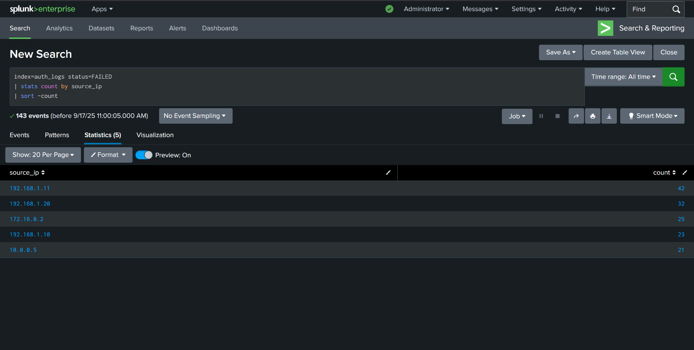
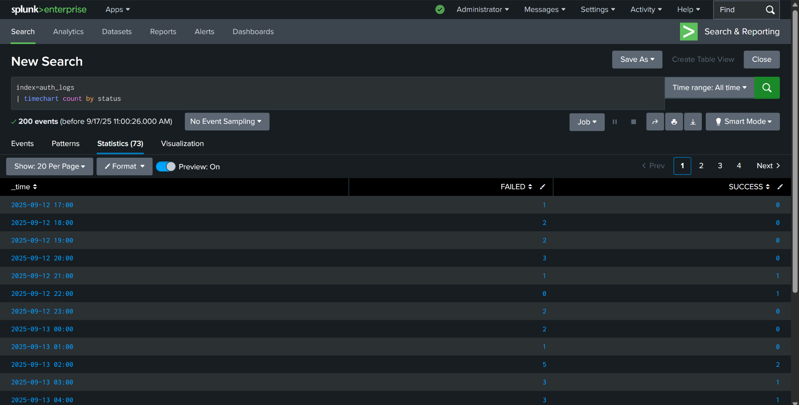
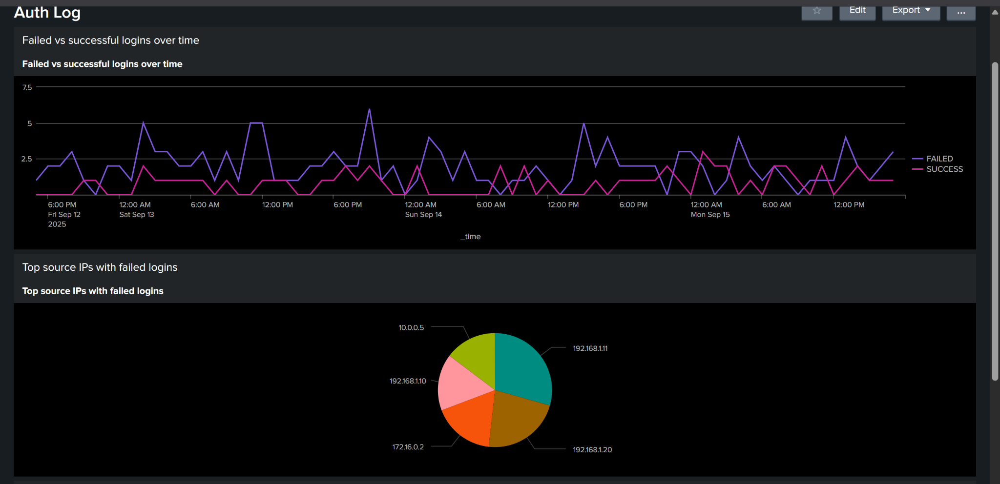
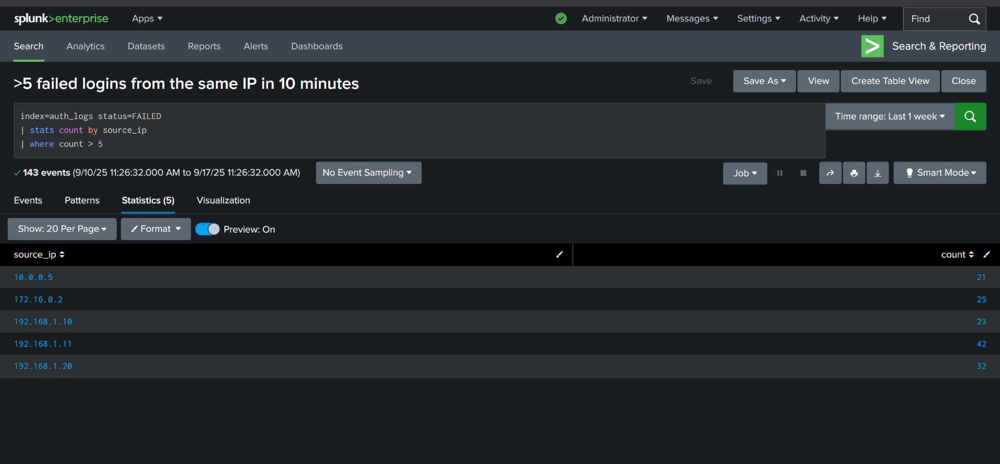
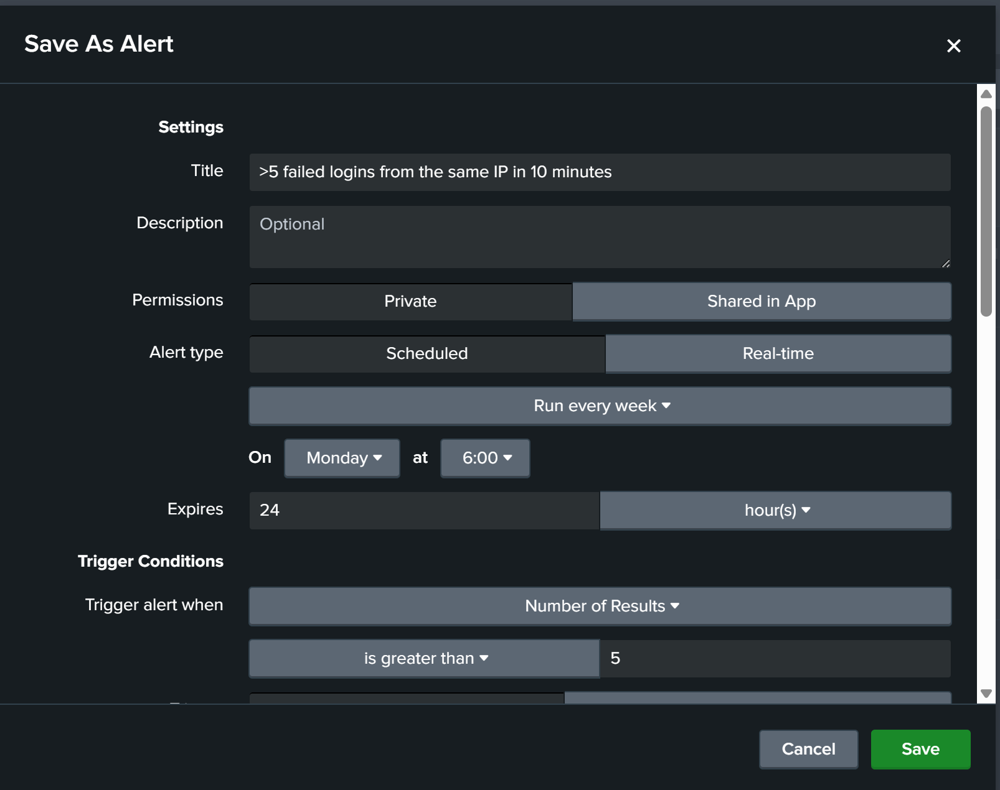
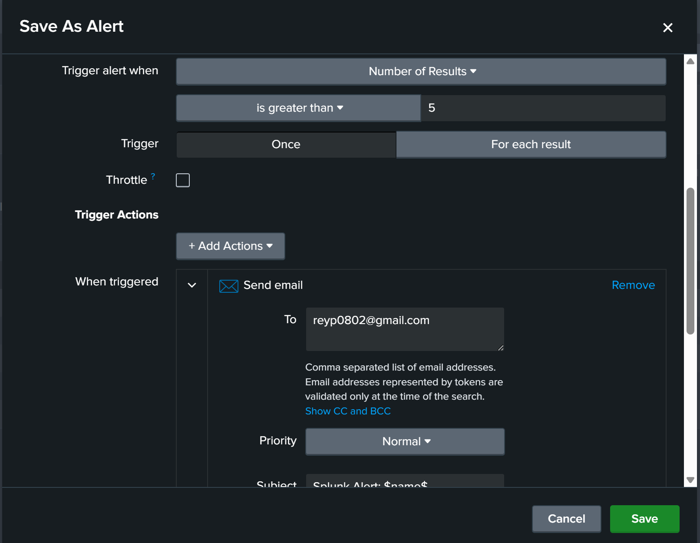

# 🔍 Splunk Mini Project: Detecting Failed Logins

## 📌 Overview
Beginner-friendly Splunk project: ingest auth logs, analyze failed logins, build a dashboard, and configure an email alert for brute-force activity.

---

## 📂 Dataset
- **File:** `auth_logs.csv` (200 synthetic events across 3 days)
- **Columns:** `timestamp, username, source_ip, status`

Example:
```
2025-09-15 10:12:03, raj, 192.168.1.10, FAILED
2025-09-15 10:12:10, raj, 192.168.1.10, FAILED
2025-09-15 10:12:15, raj, 192.168.1.10, SUCCESS
```

---

## ⚙️ How to Reproduce
1. Open Splunk Web → **Settings → Add Data → Upload** → select `auth_logs.csv`.
2. Index: create/use `auth_logs`.
3. Run these SPL searches:

**Failed logins by user**
```spl
index=auth_logs status=FAILED
| stats count by username
| sort -count
```


**Failed logins by IP**
```spl
index=auth_logs status=FAILED
| stats count by source_ip
| sort -count
```


**Login attempts over time**
```spl
index=auth_logs
| timechart count by status
```


---

## 📊 Dashboard
- Bar: Failed logins by username
- Pie: Failed logins by IP
- Line: Failed vs Successful logins over time



📄 Full dashboard export:  

---

## 🚨 Alert (Brute-force by IP)
Query:
```spl
index=auth_logs status=FAILED
| stats count by source_ip
| where count > 5
```
- Trigger: Number of results > 0
- Schedule: your choice (real-time or periodic)
- Action: Send email

Screenshots:





---

## 🚀 Future Enhancements
- GeoIP enrichment & world map
- Detect failed→success sequences (transaction)
- MITRE ATT&CK T1110 mapping
- Add Windows / Apache logs for multi-source correlation

---

## ✅ What’s Included
- `auth_logs.csv`
- `README.md`
- `auth_log-2025-09-17.pdf`
- `screenshots/` (13 images)
